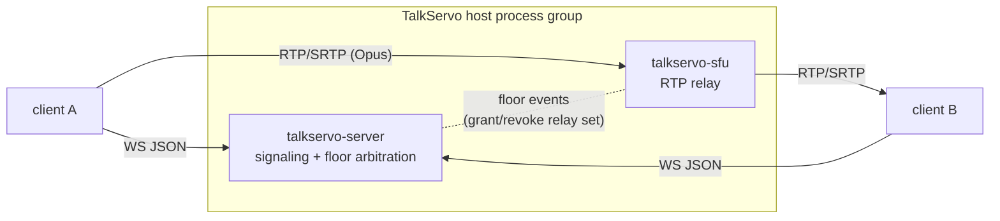

# TalkServo Architecture

> Phase 0 — architecture definition | 2026-09-28 | Source: [whitepaper.md](whitepaper.md) | Decisions: D1-D5 ([.agents/memorys/decisions.md](../.agents/memorys/decisions.md))

Status: planning draft. No implementation exists yet; every boundary below is a commitment for the PoC, not a description of shipped code. Module-level docs will be split out when the corresponding crate lands.

## 1. Overview

TalkServo is a real-time voice **floor-control platform** covering three operating modes with one abstraction:

| Mode | FloorMode | Speakers | Use case |
|------|-----------|----------|----------|
| PTT intercom | `Exclusive` | exactly 1 (the holder) | dispatch, emergency |
| Full-duplex conference | `Open` | all unmuted participants | team voice channel |
| Hybrid | `Hybrid` | dynamic, by role/priority | commander barge-in into a channel |

Design principles (inherited posture from the MediaServo sister project, adapted):

| Principle | Meaning |
|-----------|---------|
| **Floor is the single primitive** | every mode is expressed as floor state + grants; no separate "PTT subsystem" vs "conference subsystem" |
| **Pure-Rust core, I/O at the edge** | `talkservo-core` has no async, no sockets — a deterministic state machine, exhaustively unit-testable |
| **Centralized arbitration** | one authority per room owns floor state; clients never self-grant |
| **SFU media path** | RTP forwarding, no decode/mix server-side (MCU deferred) |
| **Protocol-first bindings** | the WS signaling contract and the SDK API contract are versioned artifacts; SDKs are thin shells over the Rust core |

## 2. Domain model: Floor

### 2.1 State machine

```text
                 +---------------------------+
                 |                           v
Idle --Request--> Requesting --grant--> Granted --release--> Releasing --> Idle
                 |             \--deny--> Denied --> Idle       ^
                 +--preempt (higher priority)---------[old holder: FloorTaken]
```

Rules:

1. `Exclusive` rooms hold at most one `Granted` floor at a time; a request while granted is queued or denied per policy (§2.4).
2. `Open` rooms grant implicitly on connect; floor state tracks only explicit mute/permission overrides.
3. `Hybrid` rooms switch `FloorMode` at runtime via an authorized `ModeChange` message; in-flight floor grants survive the switch (the holder keeps the holder role until release or pre-emption).
4. Timeout release: a `Granted` holder exceeding `floor_max_hold_ms` (config, default: none) is force-released; server emits `FloorIdle` + `FloorTimeout`-reason.
5. Disconnect of the holder releases the floor immediately (reconnect grace window configurable, default 0 in PoC).

### 2.2 Floor state (canonical, in `talkservo-core`)

```rust
pub struct FloorState {
    pub mode: FloorMode,
    pub holder: Option<PeerId>,       // Some while Granted (Exclusive/Hybrid)
    pub queue: Vec<FloorRequest>,     // pending requests, ordered
    pub generation: u64,              // bumped on every transition — clients reject stale events
}
```

Every transition returns a new `FloorState` (immutable update, per coding-style); the server persists nothing but the per-room current state (PoC: in-memory).

### 2.3 Priority model

| Layer | Field | Semantics |
|-------|-------|-----------|
| User | `user_priority: u8` | static capability ceiling assigned by role (commander > admin > member) |
| Request | `request_priority: u8` | per-request priority; must be `<= user_priority` or the request is `Denied(reason=ExceedsCeiling)` |
| Pre-empt | `preempt: bool` | emergency flag; only effective if `request_priority > holder.user_priority`; interrupts holder with `FloorTaken` |

Arbitration function (pure, in core):

- PoC: FCFS within equal priority; strict priority across levels; pre-emption per table above.
- Later: round-robin groups, weighted fair queuing — both live behind the same `arbitrate(&FloorState, &FloorRequest) -> Decision` seam.

### 2.4 Signaling messages (WS JSON, serde-tagged)

```rust
#[serde(tag = "type", rename_all = "snake_case")]
enum SignalingMessage {
    // client -> server
    Join { room: RoomId, token: Jwt },
    FloorRequest { room: RoomId, priority: u8, preempt: bool },
    FloorRelease { room: RoomId },
    MuteSet { room: RoomId, peer: PeerId, muted: bool },   // Open-mode admin control
    ModeChange { room: RoomId, mode: FloorMode },          // authorized only
    // server -> client
    FloorGranted { room: RoomId, peer: PeerId, generation: u64 },
    FloorTaken { room: RoomId, peer: PeerId, by: PeerId }, // pre-empted holder
    FloorDenied { room: RoomId, reason: DenyReason },
    FloorIdle { room: RoomId, generation: u64 },
    PeerList { room: RoomId, peers: Vec<PeerInfo> },
    Error { code: ErrorCode, detail: String },
}
```

Wire-format discipline: `snake_case` externally-tagged `type` field; additive-only evolution within a major protocol version; unknown fields rejected in debug builds, ignored in release (serde default). The OpenAPI/JSON-schema of this contract is a planned artifact once `talkservo-core` types compile.

## 3. Component architecture

### 3.1 Crate layout (mirrors MediaServo naming discipline)

```text
crates/
├── talkservo-core/      # Floor state machine, priorities, message types. No async, no I/O.
├── talkservo-server/    # axum HTTP + WebSocket signaling, room registry, floor arbiter host.
├── talkservo-sfu/       # webrtc-rs based audio SFU (feature-gated `sfu-webrtc`; stub backend for CI).
└── talkservo-client/    # Rust client SDK core (signaling client + session state); bindings shell.
```

| Crate | Depends on | Public surface |
|-------|-----------|----------------|
| `talkservo-core` | serde, thiserror | types + pure functions; the contract all other crates implement against |
| `talkservo-server` | core, axum, tokio-tungstenite, jsonwebtoken | binary `talkservo-server`; REST health + WS `/signaling` |
| `talkservo-sfu` | core (ids), webrtc-rs | `Sfu` service trait: `add_peer/remove_peer/relay_control` |
| `talkservo-client` | core, tokio-tungstenite | `Session` API; consumed by wasm-bindgen + UniFFI shells |

Feature-gate posture (D5): all PoC-required functionality builds with **default features**; `sfu-webrtc` is default-on locally and in CI-linux; a `stub-media` backend exists for platforms without webrtc-rs support, matching MediaServo's multi-backend lesson.

### 3.2 Runtime topology (PoC = single process? no — two processes, one host)



- Signaling and media are **separate processes** sharing only the `talkservo-core` types — failure isolation and independent scaling come free.
- The SFU relay decision is data, not logic duplication: the server pushes `Grant(peer)` / `Revoke()` control messages reflecting floor transitions; the SFU never arbitrates.
- STUN/TURN (coturn) deployed alongside; no ICE-less LAN assumption, even for local development (MediaServo lesson: loopback WebRTC still needs ICE).

## 4. Media pipeline

### 4.1 Audio path

```text
mic -> 3A (AEC/AGC/ANS, webrtc-audio-processing FFI) -> Opus encoder (inband FEC ON)
   -> RTP pack (webrtc-rs) -> network -> SFU relay (RTP only)
   -> receiver: loss detect -> Opus decode (fec=true on lost frame) -> jitter buffer -> playback
```

| Stage | PoC owner | Notes |
|-------|-----------|-------|
| Capture | client platform API | web: `getUserMedia`; native: cpal |
| 3A | `webrtc-audio-processing` (FFI) | the only C++ dependency in the tree; pure-Rust swap-in evaluated at productization |
| Codec | Opus 48 kHz / VoIP mode / 20 ms | FEC + PLC flags set at encoder init |
| Transport | webrtc-rs SRTP over UDP | DTLS handshake per peer |
| SFU | webrtc-rs, single-audio-track relay | Exclusive mode: relay only holder→listeners; Open mode: full mesh relay |
| Recovery | receiver-side | seq/SSRC loss detection, secondary `fec=true` decode, then PLC |

### 4.2 Floor↔media coupling

- Gaining the floor does **not** renegotiate ICE or restart the peer connection: the audio track stays published; the SFU grant/revoke decides who is audible. This keeps PTT press-to-audible latency at one signaling RTT + SFU switch, not a session setup.
- Client keeps a warm `RTCPeerConnection` per room; `keydown`→`FloorRequest`, `FloorGranted`→unmute/encode-live, `keyup`→`FloorRelease`.

## 5. Room lifecycle & membership

```text
create (authorized user or static config) -> open (peers join)
   -> floor activity per §2 -> empty (peers leave; state GC after TTL) -> destroy
```

PoC decisions: rooms created on demand by first joiner; auth = signed JWT issued by the server (`Join.token`); membership caps per room: 1 holder + N listeners, N configured, default 10.

## 6. Deployment modes

| Mode | Shape | Stage |
|------|-------|-------|
| All-in-one binary | signaling + SFU in one process, loopback dev | PoC |
| Split services | §3.2 two processes, shared config, coturn alongside | Alpha |
| Edge/cloud | multiple SFU instances per region, signaling cluster, K8s + Helm | Production |
| Converged | + SIP/RTP gateway for telephony and private-network interworking | post-Beta, gateway boundary reserved in `talkservo-server` as external `RelayBackend` |

## 7. Security posture (boundary checklist)

- JWT validation on `Join`; room-scoped tokens (audience = room).
- WS auth before any floor message is accepted; `ModeChange`/`MuteSet` require elevated `user_priority`.
- SRTP mandatory; no plaintext RTP fallback.
- Rate limiting on floor requests per peer (anti floor-flood DoS): `floor_request_cooldown_ms`.
- No secrets in code (repo rule): keys/TURN credentials via env at startup, validated fail-fast.
- Full OWASP pass scheduled via `security-hardening` skill before Beta.

## 8. Open questions (tracked, not decided)

| # | Question | Blocking? | Notes |
|---|----------|-----------|-------|
| OQ-1 | webrtc-rs audio-only SFU shape: compose from `broadcast`/`rtp-forwarder` primitives vs thin custom router vs sans-IO `webrtc-rs/sfu` crate (see research/oss-voice-infrastructure.md) | PoC media | start from broadcast/rtp-forwarder patterns; ion-sfu (inactive since 2023, repo not archived) as reference |
| OQ-2 | MQTT as secondary transport | no | WebSocket-first; MQTT driver deferred |
| OQ-3 | Recording boundary (server-side holder capture) | no | post-PoC; affects `talkservo-sfu` only |
| OQ-4 | Multi-SFU routing (holder on different SFU than listeners) | no | Alpha, edge deployment concern |
| OQ-5 | Data-channel vs audio-channel side-effects (text chat in PTT session) | no | YAGNI until asked |
| OQ-6 | floor-message delivery guarantee: MCPTT uses per-message re-send timers (TS 24.380 T101/T20/C20); our WS events are at-most-once | Alpha signaling hardening | options: app-level ack + re-send, or reconnect replay keyed by `generation`; see research/standards-ptt-mcptt.md |

## 9. PoC acceptance scenarios (normative)

1. A presses PTT → A gets `FloorGranted`; B, C requests → `FloorDenied(reason=FloorBusy)`.
2. A's voice reaches B, C within the SFU relay while granted.
3. A releases → `FloorIdle`; B may now be granted.
4. Commander (higher priority) requests with `preempt=true` during A's hold → A receives `FloorTaken`, commander receives `FloorGranted`.
5. Holder disconnects → floor released, room returns to Idle, `PeerList` updated.

Each scenario is a `talkservo-core` unit test (state-machine level) plus an integration test (signaling level) once the server lands; media path verified manually in-browser for PoC (Playwright flow documented when client exists).

## 10. Relationship to MediaServo

| Aspect | MediaServo | TalkServo |
|--------|-----------|-----------|
| Domain | multimedia infra (video/teleop/streaming) | voice floor control (PTT/conference) |
| SFU backend | mediasoup C++ worker (FFI) | webrtc-rs (pure Rust) — PoC avoids the heavy-FFI path deliberately |
| Arbitration | none (no floor concept) | the core primitive |
| Shared conventions | crate naming, serde wire discipline, feature-gated backends, .agents memory system | same, inherited by reference, re-earned per PIT-1 rule |
| Reusable material | docs structure, CI layout, mediasoup experience (reference only — different media engine) | — |
