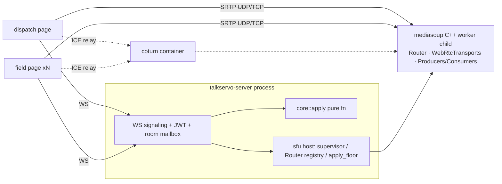

# Component Architecture
> Design module of the TalkServo architecture family. Master doc: [../architecture.md](../architecture.md) — principles, open questions, acceptance. External evidence lives in [../reference/](../reference/); this folder holds design (what we build), reference holds knowledge (what exists). Convention C2.

## 1. Layout

PoC process shape = vertical slice: one managed binary supervising its mediasoup worker (D2's split becomes physical at Alpha; crate boundaries exist from day one).



| Crate | Responsibility | Depends on | Test surface |
|-------|----------------|-----------|--------------|
| `talkservo-core` | FloorState, apply(), message enums, DenyReason | serde, thiserror | exhaustive unit (no tokio/I-O) |
| `talkservo-sfu` | supervisor + worker lifecycle, Router registry, `Sfu` trait below, SDP↔RtpParameters | core, mediasoup 0.24 | integration (Linux); stub on macOS |
| `talkservo-server` | axum+WS, room mailbox, timers, rate limit, e2e glue | core, sfu, tokio-tungstenite, jsonwebtoken | integration (stub-media) + e2e |

```rust
#[async_trait] pub trait Sfu {
    async fn create_transport(&self, room, peer) -> TransportInfo;
    async fn produce(&self, room, peer, rtp_params) -> ProducerId;
    async fn apply_floor(&self, room, &FloorState);   // idempotent: diff consumers to state
    async fn peer_left(&self, room, peer);
}
```

`apply_floor` consumes **state, not events** — replayable, self-healing after R/W sequences; internal diff over existing consumers.

Feature gates (D5 amended by D6/D7) — single source of truth in `talkservo-server/Cargo.toml`:

```toml
[features]
default = ["sfu-mediasoup"]
sfu-mediasoup = ["dep:mediasoup"]   # Linux x86_64 only
stub-media = []                      # explicit opt-in; sfu host compiles to a no-op transport
```

Mutual exclusion enforced at compile time (`cfg` assert: exactly one of `sfu-mediasoup`/`stub-media` active). macOS/CI check path: `cargo check --workspace --no-default-features --features stub-media`. `talkservo-client` crate deferred to first native consumer (D7).

## Repository layout

Workspace shape mirrors MediaServo (`crates/*` + binding cdylibs as members; bindings live at repo root, not under crates/):

```text
TalkServo/
├── Cargo.toml                 # [workspace] members = crates/* (+ binding crates when they exist); Cargo.lock committed
├── rust-toolchain.toml  pixi.toml  deny.toml  clippy.toml  tarpaulin.toml     # toolchain/task layer (sister-parity)
├── crates/
│   ├── talkservo-core/        # D1/D5 pure domain
│   ├── talkservo-sfu/         # D6 mediasoup host (feature sfu-mediasoup | stub-media)
│   ├── talkservo-server/      # binary: signaling + embedded web dist (rust-embed)
│   └── talkservo-client/      # created at first native consumer (D7/D8) — not before
├── bindings/                  # appears at Beta, layout per 07-sdk-strategy.md
├── web/                       # React SPA (Vite → dist/ → rust-embed; sister uses www/ — we keep web/)
├── config/  scripts/  docker/ # sample config (env-driven, no secrets) · talkservo.sh / pixi entries · docker/: compose files + Dockerfile (ubuntu:22.04 worker; docker/ dir decided by modules/09, supersedes earlier deploy/ mention)
├── docs/                      # architecture master + modules/ + reference/ (C2)
└── .github/workflows/         # fmt/check/clippy/test(mac+linux) + test-mediasoup(ubuntu) + e2e(nightly)
```

Phase-gated membership: PoC workspace = `crates/{core,sfu,server}` only; `talkservo-client` and everything under `bindings/` join the members list when their directories gain real code — no empty cargo shells.
