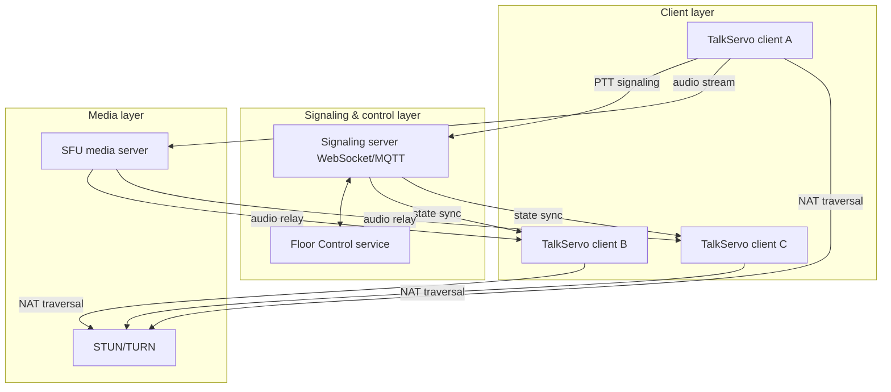

# TalkServo Whitepaper

**A real-time voice floor-control platform for PTT, full-duplex, and hybrid modes**

- Version: 0.1
- Date: 2026-09-28
- Status: Proof-of-Concept (PoC) planning draft
- Tech spine: Rust core + WebRTC media stack + multi-language SDK + Web/TS client

---

## 1. Summary

TalkServo is a **floor-control platform** for real-time voice, aiming to support three modes in one system:

- **PTT (push-to-talk) half-duplex intercom** — exactly one speaker holds the floor; everyone else listens.
- **Full-duplex voice conferencing** — many participants may speak simultaneously (Discord / Zoom style).
- **Hybrid mode** — half-duplex and full-duplex switch dynamically by role, priority, and scenario.

Rust is the core implementation language: server, SDK core logic, and floor arbitration are all Rust, exported as multi-language bindings via UniFFI / wasm-bindgen. The web client is TypeScript + React. The media layer avoids Google libwebrtc, evaluating **webrtc-rs**, **libdatachannel**, and similar alternatives to stay lightweight while retaining production-grade WebRTC audio.

TalkServo's central abstraction is the **Floor** (speaking right). PTT is an *exclusive floor*; a full-duplex conference is an *open floor*; hybrid mode is *dynamic floor-mode switching*. One abstraction covers both intercom and conferencing, making TalkServo general real-time voice control infrastructure rather than a niche walkie-talkie app.

## 2. Background & Problem

Classic PTT is radio-based and inherently half-duplex. Public-network PTT — **PoC (Push-to-talk over Cellular)** — extends push-to-talk to cellular data networks. Modern team communication needs are more demanding:

- Dispatch scenarios need strict half-duplex, priorities, and pre-emption.
- Meeting scenarios need free full-duplex speaking.
- Emergency scenarios need commander barge-in.
- Enterprise scenarios need interworking with existing telephony, private networks, and SIP.

Existing open-source projects almost all cover a single mode — pure PTT or pure conferencing. TalkServo's goal is a **unified floor model** implemented consistently across server, SDK, and client for PTT, full-duplex, and hybrid operation.

## 3. Terminology & Positioning

### 3.1 PTT vs PoC (overload warning)

| Term | Expansion | Meaning |
| :--- | :--- | :--- |
| **PTT** | Push to Talk | push-to-talk, the generic half-duplex service name |
| **PoC** | Push to Talk over Cellular | PTT over cellular networks — a PTT-industry term |
| **PoC** | Proof of Concept | project-stage term — the generic sense |

TalkServo is a PoC (Push-to-talk over Cellular) system in the PTT domain, and the project itself is currently in its PoC (Proof of Concept) stage. Documents disambiguate by context.

### 3.2 Communication modes

| Mode | Direction | Simultaneous speaking | Typical case |
| :--- | :--- | :--- | :--- |
| Simplex | one-way | no | broadcast |
| Half-duplex | two-way | no | radio, PTT |
| Full-duplex | two-way | yes | telephone, conferencing |

TalkServo supports half-duplex, full-duplex, and hybrid modes.

## 4. Naming & Brand

Project name: **TalkServo**

- *Talk* — voice, conversation.
- *Servo* — precise servo control; mirrors the core technical act of arbitrating who speaks when, by priority and mode.
- No "PTT" in the name, so half-duplex, full-duplex, and hybrid modes are all naturally covered.
- Preliminary availability check: no active name-squat found on crates.io, npm, GitHub, `talkservo.dev`, `talkservo.io`.
- Caveat: the Rust community strongly associates "Servo" with Mozilla's **Servo browser engine**. The README must disclaim on its first line:

> TalkServo — Real-time voice floor control for PTT and full-duplex conferencing. Not affiliated with the Servo browser engine.

Before release, complete trademark searches (USPTO, EUIPO, China Trademark Office), focusing on Class 9 (software) and Class 38 (telecommunications services).

## 5. Core Model: Floor Control

### 5.1 Floor modes

```rust
enum FloorMode {
    Exclusive, // PTT: one speaker holds the floor, others listen
    Open,      // full-duplex conference: many speakers at once
    Hybrid,    // dynamic switching by priority/role
}
```

### 5.2 State machine

```text
Idle -> Requesting -> Granted -> Releasing -> Idle
                    -> Denied
```

### 5.3 Signaling messages

`FloorRequest`, `FloorGranted`, `FloorTaken`, `FloorRelease`, `FloorIdle`, `FloorDenied`.

### 5.4 Priority system

| Priority type | Description |
| :--- | :--- |
| User priority | assigned by role/level (admin, commander) |
| Floor-request priority | priority of this request; capped by the user's maximum |
| Pre-emption priority | emergency barge-in; can interrupt the current holder |

### 5.5 Arbitration algorithms

- First-come-first-served (FCFS)
- Priority-based scheduling
- Queuing
- Pre-emption
- Round-robin / weighted fair queuing (later extension)

## 6. System Architecture

Recommended: **centralized signaling + SFU media forwarding**.



- **Client layer** — web: TypeScript + React + WebRTC; mobile/desktop via Rust SDK bindings. PTT mapped to key/mouse press-release; audio tracks enabled only while holding the floor, otherwise muted with the connection kept alive.
- **Signaling & control layer** — WebSocket / MQTT carries PTT signaling, membership, arbitration results; the Floor Control service arbitrates centrally and owns room state; must handle timeout release, reconnect, pre-emption.
- **Media layer** — SFU forwards RTP without decoding/mixing; in group PTT it forwards only the current holder's audio; in full-duplex it forwards all members; STUN/TURN deployment is mandatory for NAT traversal.
- **Alternative topologies** — P2P mesh (2-3 party, minimal), centralized SFU (recommended), distributed/cloud-native (edge SFU + K8s + distributed arbitration), converged architecture with SIP/private-network gateways.

Full details in [architecture.md](architecture.md).

## 7. Technology Selection

- **WebRTC engine: webrtc-rs preferred** — pure Rust, language-aligned with the core, actively maintained (5.1k stars, 2026-09 snapshot). Note: the webrtc-rs org publishes a sans-IO `sfu` building-block crate (active, pushed 2026-09-13) but **no complete SFU example** — the relay is composed from `broadcast`/`rtp-forwarder` patterns or atop that crate, with `pion/ion-sfu` (inactive since 2023) as architecture reference. libdatachannel (C++) suits C/C++ ecosystems; Google libwebrtc is not adopted.
- **Audio FEC lives in Opus, not the transport** — the encoder embeds a low-bitrate redundancy of the previous frame; receivers re-decode with `fec=true` on detected loss. SFU forwarding preserves it end-to-end. webrtc-rs requires manual Opus FEC configuration plus loss detection and second-decode logic.
- **3A (AEC + AGC + ANS)** — PoC uses the `webrtc-audio-processing` FFI (Google-proven); pure-Rust alternatives (`sonora`, `aec3-rs`) or composed crates (`nnnoiseless` + `decibri-aec` + `dagc`) are productization-stage evaluations.
- Supporting stack: Opus; WebSocket (general) / MQTT (IoT); axum; tokio-tungstenite; UniFFI / wasm-bindgen; React + TypeScript; coturn for STUN/TURN; Kubernetes + Helm at the production stage.

Comparative tables and reasoning: [research/media-stack-alternatives.md](reference/research/media/media-stack-alternatives.md).

## 8. Open-Source Landscape (reference anchors)

Star counts are a 2026-09 snapshot and may drift; see [research/ptt-landscape.md](reference/research/ptt/ptt-landscape.md) for profiles and verified details.

| Project | URL | Stars | Voice? | Note |
| :--- | :--- | :--- | :--- | :--- |
| talkkonnect | github.com/talkkonnect/talkkonnect | 363 | yes | headless Mumble client; active; multicast-RTP/SIP bridges |
| talktome | github.com/thepoison606/talktome | 123 | yes | web intercom on mediasoup; most active in set |
| EVO-PTT | github.com/Theofilos-Chamalis/EVO-PTT | 118 | yes | commercial PTT; core voice server closed-source |
| Gryt | github.com/Gryt-chat/gryt | 37 | yes | self-hosted voice platform, Go (Pion) SFU; active |
| Radio-Link | github.com/Radio-Link/Radio-link | 0 | yes | Flutter + WebRTC P2P prototype; dormant |
| Zello_Walk | github.com/RobCrack2023/Zello_Walk | 0 | yes | Socket.io relay PWA toy — media anti-pattern evidence |
| ~~OpenPTT~~ | github.com/OpenPTT/OpenPTT | 355 | **no** | text BBS client for ptt.cc, stale since 2016 — **not a voice peer** (initial discussion misclassified it) |

## 9. PoC Roadmap

1. **Core protocol & state machine (1-2 d)** — `talkservo-core`: Floor state machine, message protocol, priority rules; pure Rust, no I/O, unit-testable.
2. **Rust signaling server (2-3 d)** — axum + tokio-tungstenite; `HashMap<RoomId, FloorState>`; handles Request/Granted/Taken/Release.
3. **Rust media server (3-5 d)** — minimal audio SFU on webrtc-rs, composed from the `broadcast` / `rtp-forwarder` example patterns or the org's sans-IO `sfu` crate; group PTT relays only the current holder.
4. **TypeScript client (2-3 d)** — single-page React app; WebSocket signaling; `RTCPeerConnection` to media; keydown/keyup PTT.

**Acceptance criteria**: while A holds the floor, B/C are denied; A's audio reaches B and C; after release the room returns to Idle; a high-priority user can pre-empt the holder.

## 10. Risks & Mitigations

| Risk | Description | Mitigation |
| :--- | :--- | :--- |
| Audio "last mile" | webrtc-rs lacks NetEQ / 3A built-in | integrate webrtc-audio-processing; grow a jitter buffer incrementally |
| FEC recovery logic | must be implemented manually | land Opus in-band FEC first, then optimize |
| Mobile background audio | background playback, power | follow Radio-Link; use platform background-audio APIs |
| Public-network QoS | no network-slice guarantees | app-layer priority + TURN relay + edge SFU |
| SIP / private-network interworking | protocol gap | reserve a SIP/RTP gateway boundary |
| Trademark & domain | TalkServo needs formal clearance | complete USPTO / China trademark searches before release |
| FFI build complexity | webrtc-audio-processing pulls C++ | acceptable in PoC; evaluate pure-Rust at productization |

## 11. Roadmap

| Stage | Goal |
| :--- | :--- |
| PoC | centralized SFU, PTT half-duplex, Floor Control proven |
| Alpha | priorities, pre-emption, queuing, hybrid-mode switching |
| Beta | multi-language SDKs, web/mobile clients, 3A integration |
| Production | cloud-native deployment, edge SFU, SIP/private-network gateways, observability & ops |

## 12. Conclusion

TalkServo is not "another PTT app" but a **hybrid-mode real-time voice floor-control platform**: one Floor abstraction unifies half-duplex and full-duplex; a Rust core guarantees cross-platform consistency; webrtc-rs replaces Google libwebrtc to stay lean; webrtc-audio-processing brings production-grade 3A to the PoC.

Recommended landing path:

> **Rust + webrtc-rs + Opus in-band FEC + webrtc-audio-processing + centralized SFU + WebSocket signaling + standalone Floor Control service.**

The single thing the PoC must prove: **the floor-control flow runs reliably and with low latency over WebRTC.** Once proven, priorities, pre-emption, hybrid mode, and SDK bindings are natural evolutions.

## Appendix A: Naming Candidates

| Name | Meaning | Fits | Issue |
| :--- | :--- | :--- | :--- |
| **TalkServo** | voice + precise control | technical platform | must disclaim the Servo browser engine |
| FloorLink | floor + connection | developer infrastructure | outsiders don't know "PTT floor" |
| PTTFusion | PTT + fusion | full hybrid-mode app | availability check needed |
| PushLink | push-to-talk + link | end-user app | confusable with push services |
| TalkLink | voice + link | general | collides with an existing PTT app |

## Appendix B: Pre-launch Checklist

- crates.io / npm / GitHub search for `talkservo`
- domains: `talkservo.dev`, `talkservo.io`
- trademarks: USPTO, EUIPO, China Trademark Office
- README disclaimer re: the Servo browser engine
- fix the `talkservo-core` / `talkservo-server` / `talkservo-sdk` namespace

---

*Compiled from project discussions; this document is not legal or trademark advice.*
